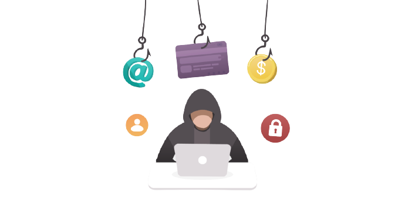
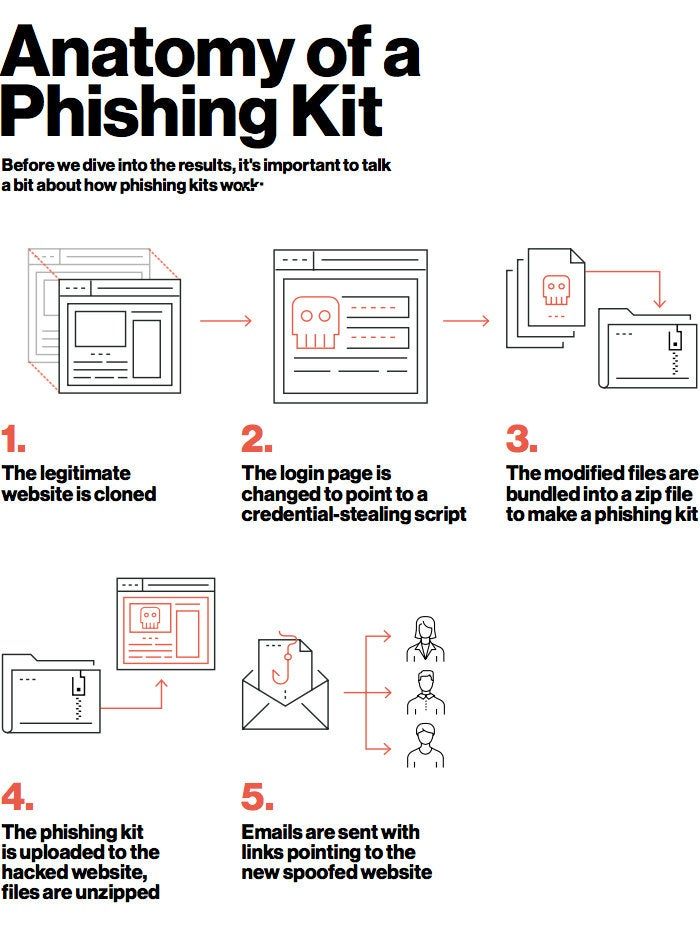

# phishing attack
Phishing is a type of social engineering attack often used to steal user data, including login credentials and credit card numbers. 
It occurs when an attacker, masquerading as a trusted entity, dupes a victim into opening an email, instant message, or text message.

It starts with a fraudulent email or other communication that is designed to lure a victim. The message is made to look as though it comes from a trusted sender.
If it fools the victim, he or she is coaxed into providing confidential information, often on a scam website. Sometimes malware is also downloaded onto the target’s computer.

## Spear Phishing
Rather than using the “spray and pray” method , spear phishing involves sending malicious emails to specific individuals within an organization. 
Rather than sending out mass emails to thousands of recipients, this method targets certain employees at specifically chosen companies
. These types of emails are often more personalized in order to make the victim believe they have a relationship with the sender.



## Anatomy of Phishing KIT

```sh
* Executed a legion of highly coordinated, multi-step attacks
* Leaned on four types of cyber attacks above all others
* Used old technologies to launch new ransomware attacks
* Used fake CDC and vaccine sign-up sites to gain access to data
```



